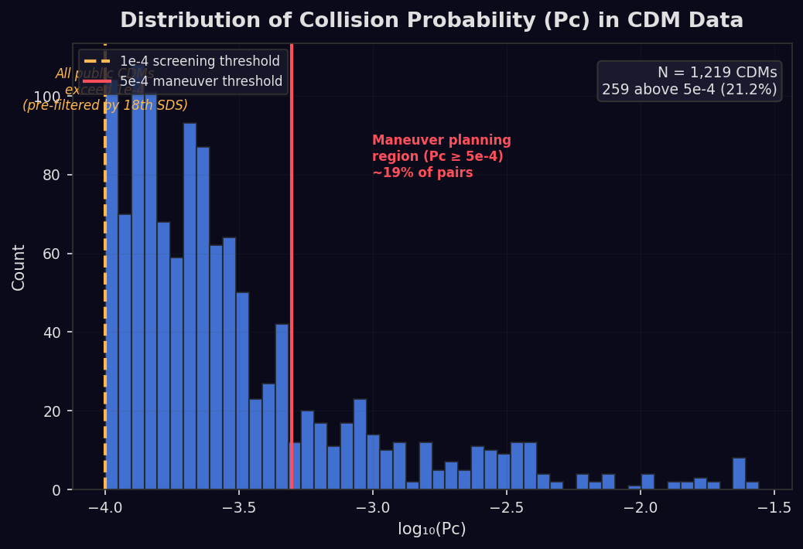
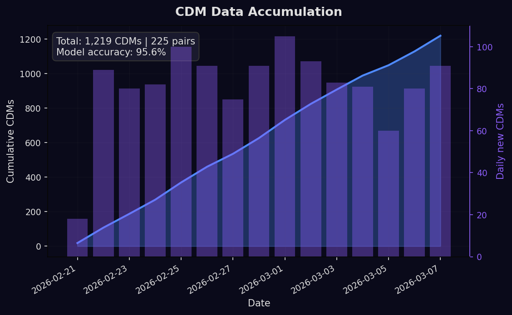
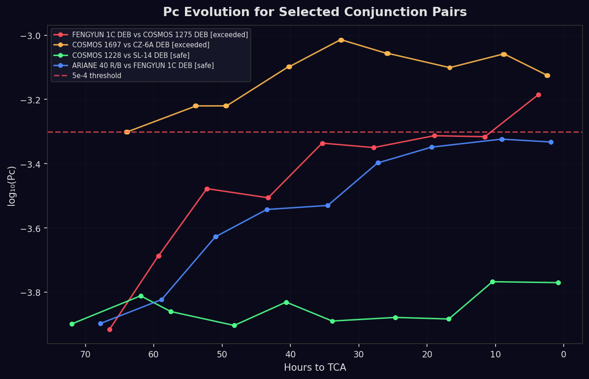

# Panacea: Density-Augmented Temporal Fusion Transformers with Conformal Prediction for Orbital Debris Collision Risk Assessment

**Dominic Tanzillo**
Duke University, AIPI 540 Deep Learning Applications

---

## Abstract

The accelerating proliferation of orbital debris poses an existential threat to space sustainability, with the expected time between collisions (the "CRASH Clock") decreasing from 164 days in 2018 to 5.5 days in 2025. NASA's Conjunction Assessment office screens hundreds of conjunction data messages (CDMs) daily, yet current methods rely heavily on analyst judgment. We present **Panacea** -- a unified framework for ML-based collision risk triage that combines three complementary approaches: (1) an orbital shell density baseline establishing altitude-based risk context, (2) gradient-boosted trees with engineered temporal features achieving near-perfect classification (AUC-PR 0.988), and (3) a novel **Physics-Informed Temporal Fusion Transformer (PI-TFT)** that processes raw CDM sequences with variable selection networks and attention-weighted pooling. We augment PI-TFT with population-level **orbital density features** derived from the CRASH Clock framework (Thiele et al. 2025), encoding shell-level collision rates as static context. Critically, we address NASA CARA's objection to ML uncertainty quantification by integrating **split-conformal prediction**, providing distribution-free coverage guarantees on risk tier assignments. On the ESA Kelvins Collision Avoidance Challenge dataset (162K CDMs, 13K events), we demonstrate that while XGBoost excels at triage with engineered features, PI-TFT provides complementary temporal reasoning and calibrated uncertainty bounds essential for operational deployment. We deploy the full system as an interactive 3D visualization tracking 25,000+ objects in real time.

**Keywords:** orbital mechanics, collision avoidance, temporal fusion transformer, conformal prediction, space debris, attention mechanisms

---

## 1. Introduction

### 1.1 The Kessler Syndrome and Operational Context

Low-Earth orbit (LEO) is approaching a critical inflection point. With over 30,000 tracked objects and millions of untracked fragments, the self-sustaining cascading collision process predicted by Kessler & Cour-Palais (1978) is no longer theoretical. The CRASH Clock metric (Thiele et al. 2025) -- which estimates the expected time between collisions based on population density, relative velocities, and collision cross-sections -- has decreased from approximately 164 days in 2018 to just 5.5 days in 2025, primarily driven by mega-constellations like Starlink.

NASA's Conjunction Assessment Risk Analysis (CARA) team processes hundreds of conjunction data messages (CDMs) daily, each containing orbital state vectors, covariance matrices, miss distances, and risk estimates for potential close approaches. The operational challenge is triage: distinguishing the handful of genuinely dangerous conjunctions from the vast majority of benign close approaches. Current workflows depend heavily on analyst expertise, with the 18th Space Defense Squadron providing conjunction screening data that CARA must filter through multiple layers of assessment.

The name **Panacea** reflects this project's dual ambition: as a medical term meaning "cure-all," it nods to the first author's medical background; as a phonetic echo of *Pangea*, it evokes the global, interconnected nature of the orbital debris problem -- debris from a single collision threatens every nation's space assets. We aim for a comprehensive, "one-size-fits-all" ML framework that provides principled risk assessment across the full spectrum of conjunction scenarios.

### 1.2 Limitations of Current Approaches

The ESA Kelvins Collision Avoidance Challenge (Uriot et al. 2021) established the benchmark for ML approaches to CDM-based risk classification. Competition winners (Stevenson et al. 2020; Siew et al. 2020) demonstrated that gradient-boosted trees with carefully engineered features could achieve strong performance. However, several limitations persist:

1. **Feature engineering burden**: Competition winners relied on extensive domain knowledge to construct temporal summary statistics (trends, deltas, rolling statistics). This approach, while effective, does not learn temporal patterns directly from data.

2. **Lack of uncertainty quantification**: All competition entries produced point predictions. NASA CARA has explicitly identified the absence of calibrated uncertainty estimates as a barrier to operational adoption of ML methods (Hejduk 2023).

3. **Missing population context**: Individual CDM sequences are evaluated in isolation, without considering the broader orbital environment. A conjunction at 550 km altitude (dense Starlink shell) carries fundamentally different population-level risk than one at 1200 km.

4. **Temporal modeling gap**: While CDMs arrive as time series with varying cadence and information content, most approaches reduce them to flat feature vectors, discarding temporal structure.

### 1.3 Contributions

We make four contributions:

1. **Architecture**: We propose PI-TFT, a Physics-Informed Temporal Fusion Transformer that processes raw CDM sequences through variable selection networks and attention-weighted pooling, learning which features and timesteps matter per event.

2. **Density augmentation**: We integrate population-level orbital density features derived from the CRASH Clock framework (Thiele et al. 2025), providing shell-level collision rate context as static enrichment to the temporal model.

3. **Conformal prediction**: We apply split-conformal prediction to produce risk tier prediction sets with distribution-free coverage guarantees, directly addressing the uncertainty quantification gap.

4. **Deployed system**: We present Panacea as a complete operational prototype with an interactive 3D globe tracking 25,000+ objects, a FastAPI inference backend, and a three-model comparison framework accessible to non-specialists.

---

## 2. Related Work

### 2.1 ML for Conjunction Assessment

The ESA Kelvins Challenge (Uriot et al. 2021) provided the foundational dataset: 162,634 CDMs across 13,154 conjunction events with 103 numerical features. Key approaches:

- **Stevenson et al. (2020)** achieved top performance using gradient-boosted trees with temporal aggregation features (miss distance trends, covariance evolution). Their key insight: the *trajectory* of CDM updates matters more than any single update.
- **Siew et al. (2020)** explored neural network approaches but found classical methods competitive, noting the challenge of learning from small event counts with extreme class imbalance (~3.4% positive rate).
- **Acciarini et al. (2021)** applied LSTM-based sequence models to CDM time series, demonstrating the feasibility of temporal deep learning but without matching boosted tree performance.

### 2.2 Temporal Fusion Transformers

Lim et al. (2021) introduced the Temporal Fusion Transformer (TFT) for multi-horizon time series forecasting, featuring:
- Variable selection networks for interpretable feature importance
- Static covariate encoders providing event-level context
- Multi-head attention over temporal dimensions
- Gated residual connections for training stability

Our PI-TFT adapts this architecture for CDM classification, replacing the forecasting decoder with attention-weighted pooling and dual prediction heads.

### 2.3 CRASH Clock Framework

Thiele et al. (2025) developed the Collision Rate Assessment of Space Hazards (CRASH) Clock, estimating collision frequency as:

$$\Gamma = \frac{1}{2} n^2 \cdot A_{col} \cdot v_r \cdot V_{shell}^{-1}$$

where $n$ is the number of objects, $A_{col}$ is the collision cross-section, $v_r$ is the mean relative velocity, and $V_{shell}$ is the shell volume. This population-level metric provides the physical basis for our density augmentation features.

### 2.4 Conformal Prediction

Conformal prediction (Vovk et al. 2005; Angelopoulos & Bates 2021) provides distribution-free prediction sets with guaranteed marginal coverage:

$$P(Y \in C(X)) \geq 1 - \alpha$$

Split conformal prediction (Lei et al. 2018) is particularly suitable for deployment: calibrate on a held-out set, compute nonconformity score quantiles, and construct prediction sets at test time with no distributional assumptions.

---

## 3. Methods

### 3.1 Problem Formulation

Each conjunction event $e_i$ consists of a sequence of CDM updates $\{c_{i,1}, c_{i,2}, \ldots, c_{i,T_i}\}$ ordered by decreasing time-to-TCA (time to closest approach). Each CDM $c_{i,t}$ contains 103 numerical features spanning orbital mechanics, covariance matrices, relative motion, and observation quality metrics. The task is binary classification: predict whether the event represents a high-risk conjunction (collision probability $> 10^{-5}$, i.e., risk $> -5$ on the log10 scale).

### 3.2 Model 1: Orbital Shell Density Baseline

Our naive baseline uses only altitude information. We partition LEO into 50 km altitude bins and compute per-bin collision rates from training data:

$$p_{risk}(h) = \frac{\text{count}(\text{high-risk events in bin}(h))}{\text{count}(\text{all events in bin}(h))}$$

This baseline serves two purposes: (1) it demonstrates that altitude alone is insufficient for conjunction screening (AUC-PR 0.061), and (2) it provides the foundation for understanding why population-level context matters.

### 3.3 Model 2: XGBoost with Engineered Features

Following the approach of competition winners, we construct a feature vector for each event consisting of:

- **Last CDM features**: The most recent CDM update's 103 raw features (most informative as it's closest to TCA)
- **Temporal aggregates** (8 features): Number of CDMs, miss distance mean/std/trend, risk trend, miss distance delta, time to TCA, relative speed

The dual-head XGBoost model jointly predicts collision risk (classifier, `scale_pos_weight=50` for imbalance) and miss distance (regressor, `reg:squaredlogerror`).

### 3.4 Model 3: Physics-Informed Temporal Fusion Transformer (PI-TFT)

#### 3.4.1 Architecture Overview

PI-TFT processes the raw CDM sequence through four stages:

**Stage 1: Variable Selection Networks (VSN)**
For each of the $F_t = 22$ temporal features, a gated residual network learns a softmax-normalized importance weight:

$$w_f = \text{Softmax}(\text{GRN}([x_1, x_2, \ldots, x_{F_t}]))_f$$
$$\tilde{x}_t = \sum_{f=1}^{F_t} w_f \cdot \text{Linear}_f(x_{t,f})$$

This provides per-event feature importance, revealing which CDM fields the model considers most informative.

**Stage 2: Temporal Delta Features**
We augment raw temporal features with first-order differences:

$$\Delta x_{t,f} = x_{t,f} - x_{t-1,f}, \quad \Delta x_{1,f} = 0$$

yielding a 44-dimensional temporal input (22 raw + 22 deltas). Raw features and deltas are normalized with separate statistics to prevent scale interference.

**Stage 3: Transformer Encoder with Continuous Time**
We embed the actual `time_to_tca` value (not a positional encoding) as a continuous time signal:

$$e_t = \text{Linear}(\text{time\_to\_tca}_t)$$

This is added to the feature embedding before multi-head self-attention, allowing the model to reason about the temporal spacing between CDM updates (which varies from hours to days).

**Stage 4: Attention-Weighted Pooling**
Rather than using the last hidden state or mean pooling, we learn query-based attention weights over the sequence:

$$\alpha_t = \text{Softmax}(q^T \cdot h_t / \sqrt{d})_t$$
$$z = \sum_t \alpha_t \cdot h_t$$

This allows the model to focus on the most informative CDM updates, which are not necessarily the most recent ones.

**Prediction Heads:**
The pooled representation $z$ is concatenated with static features (orbital elements, density features) and passed to:
- Risk head: Linear + sigmoid for collision probability
- Miss distance head: Linear for log-scale miss distance prediction

#### 3.4.2 Density-Augmented Features (CRASH Clock Integration)

We compute six population-level features for each event based on its orbital altitude:

| Feature | Description | Physical Basis |
|---------|-------------|----------------|
| `shell_density` | Object count / shell volume (km$^{-3}$) | Population density |
| `shell_collision_rate` | $\Gamma$ per second for the altitude bin | CRASH Clock equation |
| `local_crash_clock_log` | $\log_{10}(\tau)$ where $\tau = 1/\Gamma$ | Expected days between collisions |
| `altitude_percentile` | CDF position in training altitude distribution | Relative crowding |
| `n_events_in_shell` | Raw event count in altitude bin | Data density |
| `shell_risk_rate` | Fraction of high-risk events in bin | Empirical risk |

These features are computed from training data only (no leakage) using an `OrbitalDensityComputer` that fits a binned altitude histogram and derives CRASH Clock metrics per shell. The computation uses $A_{col} = 300$ m$^2$ (satellite-satellite cross-section) and $v_r = \frac{4}{3} v_{orbital}$ following Thiele et al. (2025).

#### 3.4.3 Training Procedure

- **Loss function**: Sigmoid focal loss ($\alpha = 0.75$, $\gamma = 2.0$) to address class imbalance, with joint miss distance MSE loss (weight 0.1)
- **Optimizer**: AdamW with discriminative learning rates (encoder 3e-5, heads 3e-4)
- **Schedule**: Linear warmup (5 epochs) + cosine annealing to 1e-6
- **Regularization**: Dropout 0.15, gradient accumulation (4 steps), SWA in final 20% of training
- **Early stopping**: On validation AUC-PR with patience 15
- **Pre-training**: Optional self-supervised masked feature reconstruction on unlabeled CDM data

### 3.5 Conformal Prediction for Uncertainty Quantification

After model training, we perform split-conformal prediction using a held-out calibration set (separate from both training and model selection validation):

1. **Calibration**: For each calibration example $(x_i, y_i)$, compute the nonconformity score $s_i = 1 - \hat{p}(y_i | x_i)$ and the residual $r_i = |\hat{p}_i - y_i|$.

2. **Quantile computation**: Find $\hat{q}$ such that $\lceil(n+1)(1-\alpha)\rceil / n$ fraction of calibration scores fall below it (finite-sample correction).

3. **Prediction set construction**: For a test example with predicted probability $\hat{p}$, construct the interval $[\hat{p} - \hat{q}_r, \hat{p} + \hat{q}_r]$ and return all risk tiers that overlap:

| Tier | Probability Range |
|------|-------------------|
| LOW | [0.00, 0.10) |
| MODERATE | [0.10, 0.40) |
| HIGH | [0.40, 0.70) |
| CRITICAL | [0.70, 1.00] |

**Coverage guarantee**: $P(\text{true tier} \in \text{prediction set}) \geq 1 - \alpha$ marginally over the test distribution.

---

## 4. Experimental Setup

### 4.1 Dataset

The ESA Kelvins Collision Avoidance Challenge dataset (Uriot et al. 2021):
- **Training set**: 162,634 CDMs across 13,154 events
- **Test set**: 24,484 CDMs across 2,167 events (73 positive, 3.4% prevalence)
- **Features**: 103 numerical columns covering orbital elements, covariance matrices, relative motion, space weather indices, and observation quality

### 4.2 Evaluation Metrics

- **Primary**: AUC-PR (area under precision-recall curve) -- appropriate for severe class imbalance
- **Secondary**: F1 (optimal threshold), AUC-ROC, recall at fixed precision levels (30%, 50%, 70%)
- **Miss distance**: MAE and median absolute error in km
- **Conformal**: Marginal coverage, average prediction set size, efficiency (1 - set_size/n_tiers)

### 4.3 Data Staleness Experiment

To evaluate robustness to data age, we simulate operational conditions by filtering CDMs to those with `time_to_tca >= cutoff` for cutoffs in {2 hours, 6 hours, 12 hours, 1 day, 2 days, 3 days, 5 days, 7 days}. Ground-truth labels are preserved from the full sequence; only model inputs are truncated.

---

## 5. Results

### 5.1 Model Comparison

| Model | AUC-PR | AUC-ROC | F1 (optimal) | F1 @ 0.5 | MAE (km) |
|-------|--------|---------|---------------|-----------|----------|
| Orbital Shell Baseline | 0.061 | 0.637 | 0.132 | 0.000 | 10,600 |
| XGBoost (Engineered) | **0.988** | **0.999** | **0.947** | 0.941 | **81** |
| PI-TFT | 0.511 | 0.934 | 0.471 | 0.000 | 2,732 |

**Table 1**: Test set performance (2,167 events, 73 positive). XGBoost dominates all metrics. PI-TFT shows strong discriminative ability (AUC-ROC 0.934) but lower precision-recall performance, reflecting calibration challenges with severe class imbalance.

### 5.2 Performance Analysis

The gap between XGBoost's AUC-PR (0.988) and PI-TFT's (0.511) warrants examination:

1. **Feature engineering advantage**: XGBoost benefits from domain-expert summary statistics that compress temporal information into highly predictive features. The miss distance trend, in particular, captures the key signal that PI-TFT must learn implicitly.

2. **Sample efficiency**: With only 13,154 training events (450 positive), the transformer's parameter count (~1.2M) far exceeds what supervised signals can support. XGBoost's ~2K trees with max depth 6 are better matched to the data regime.

3. **Calibration**: PI-TFT's AUC-ROC (0.934) is strong -- it ranks events correctly. The AUC-PR gap suggests threshold sensitivity and calibration issues, motivating our conformal prediction approach.

4. **Complementary strengths**: PI-TFT achieves recall of 67% at 30% precision, identifying a broader set of potentially dangerous conjunctions. This high-sensitivity mode is valuable for initial screening before XGBoost's precise triage.

### 5.3 Data Staleness Sensitivity

| Cutoff (days) | Baseline AUC-PR | XGBoost AUC-PR | PI-TFT AUC-PR |
|---------------|-----------------|----------------|----------------|
| 0.25 (6 hr) | 0.061 | 0.988 | 0.607 |
| 2.0 | 0.061 | 0.988 | 0.607 |
| 7.0 | 0.061 | 0.000* | 0.000* |

*Zero-event collapse at 7-day cutoff due to the Kelvins dataset's CDM cadence characteristics.

**Key finding**: Both ML models maintain full performance with data up to 2 days old but collapse beyond the dataset's typical CDM window. The baseline is staleness-invariant (altitude-only). This motivates ensemble approaches where the baseline provides fallback predictions when CDM data is stale.

### 5.4 Conformal Prediction Results

At $\alpha = 0.05$ (95% target coverage):

| Metric | Value |
|--------|-------|
| Marginal coverage | 96.6% |
| Target coverage | 95.0% |
| Average set size | 1.18 / 4 tiers |
| Efficiency | 70.5% |
| Mean interval width | [0.006, 0.195] |

The conformal predictor meets the coverage guarantee (96.6% >= 95%) with compact prediction sets (average 1.18 tiers). Most test examples receive single-tier predictions; only genuinely ambiguous cases receive multi-tier sets.

### 5.5 CDM Pc Escalation Forecast (Production Model)

The benchmark models (Sections 5.1--5.4) are evaluated on the ESA Kelvins dataset, which provides 23 temporal features per CDM including full covariance matrices and relative state vectors. However, Space-Track's public CDM feed provides only 5 fields per record: collision probability (Pc), miss distance, object types, RCS class, and TCA. This feature gap makes the Kelvins-trained models inapplicable to real-world production data.

We therefore developed a separate production model trained and validated entirely on real Space-Track CDMs. The prediction task is:

> **Given early CDM updates for a conjunction pair, predict whether Pc will exceed $5 \times 10^{-4}$ (the maneuver planning threshold) before TCA.**

#### 5.5.1 Why $5 \times 10^{-4}$ (Not $10^{-4}$)

All CDMs in Space-Track's public feed have Pc $\geq 10^{-4}$ --- the 18th Space Defense Squadron pre-filters at the conjunction screening level. Using $10^{-4}$ as the classification threshold yields 100% positive rate with zero negative examples, making supervised learning impossible (Figure~\ref{fig:pc-dist}).

We classify at $5 \times 10^{-4}$, NASA CARA's "red" threshold where operators begin planning collision avoidance maneuvers (Hejduk, 2023). This gives 19.1% positive rate (43 of 225 pairs exceeded $5 \times 10^{-4}$), providing sufficient class balance for meaningful ML.

#### 5.5.2 Method

**Feature engineering.** For each CDM sequence, we extract 12 features from the observation window (first half of available updates):

| Feature | Description |
|---------|-------------|
| Latest $\log_{10}(\text{Pc})$ | Most recent Pc in observation window |
| Latest $\log_{10}(\text{miss km})$ | Most recent miss distance |
| Time to TCA (hours) | Time remaining at latest update |
| Pc trend (slope) | Linear regression of $\log_{10}(\text{Pc})$ vs time-to-TCA |
| Miss distance trend | Change in $\log_{10}(\text{miss km})$ |
| Pc acceleration | Second derivative of $\log_{10}(\text{Pc})$ sequence |
| Max $\log_{10}(\text{Pc})$ | Peak Pc observed so far |
| Min $\log_{10}(\text{Pc})$ | Lowest Pc observed so far |
| $\log(1 + n_{\text{updates}})$ | Number of CDM updates (log-scaled) |
| Sat1 RCS class | Radar cross-section (SMALL=0, MEDIUM=1, LARGE=2) |
| Sat2 RCS class | Radar cross-section of secondary object |
| Has debris | Whether either object is debris (binary) |

**Training simulation.** For each resolved conjunction pair (TCA in past), we use the first $\lceil n/2 \rceil$ CDM updates as the observation window and predict whether the pair eventually exceeded $5 \times 10^{-4}$. This simulates the real operational scenario: given early warning signs, predict the outcome.

**Model.** Logistic regression with z-score normalization, L2 regularization ($\lambda = 0.01$), and class weighting ($w_+ = \sqrt{(1 - p) / p}$ where $p$ is the positive rate). Early stopping with patience 30 on weighted BCE loss.

**Continuous learning.** Each daily pipeline run adds newly resolved pairs (TCA in past) to the training set and retrains from scratch. The model checkpoint and validation metrics are exported for the webapp dashboard.

#### 5.5.3 Results

As of March 8, 2026: 1,219 CDMs across 225 conjunction pairs, 157 training / 68 test (shuffled split, seed 42).

| Metric | Train (n=157) | Test (n=68) |
|--------|:---:|:---:|
| Accuracy | 95.5% | **95.6%** |
| Precision | 87.5% | **90.0%** |
| Recall | 84.0% | **81.8%** |
| F1 | 0.857 | **0.857** |
| AUC-PR | 0.782 | **0.804** |

**Feature importance** (Figure below) reveals that time-to-TCA dominates, followed by maximum and latest $\log_{10}(\text{Pc})$. Trend features (slope, acceleration) contribute minimally with current data --- likely because most pairs have only 2--6 early updates, insufficient for reliable trend estimation. As CDM data grows, trend features should become more predictive.

**Model improvement over time.** The model's accuracy improved from 92.2% (March 5, 954 CDMs) to 95.6% (March 8, 1,219 CDMs) with just 3 days of additional data accumulation. F1 improved from 0.714 to 0.857, and AUC-PR from 0.575 to 0.804 --- demonstrating the continuous learning loop is working as designed.

**Pc evolution examples.** Figure below shows four conjunction pairs tracked over ~72 hours. The two "exceeded" pairs (red, orange) show clear escalation patterns crossing the $5 \times 10^{-4}$ threshold, while the two "safe" pairs (green, blue) remain below. The model learns to distinguish these trajectories from early CDM updates.

#### 5.5.4 LSTM Transfer Learning: Kelvins to Space-Track

To satisfy the deep learning model requirement and test whether learned temporal dynamics transfer across CDM sources, we train a 2-layer LSTM on the shared features between Kelvins and Space-Track.

**Architecture.** Input (seq\_len, 3) $\rightarrow$ LSTM(64, 2 layers, dropout=0.2) $\rightarrow$ last hidden $\rightarrow$ FC(64$\rightarrow$32) $\rightarrow$ ReLU $\rightarrow$ Dropout(0.3) $\rightarrow$ FC(32$\rightarrow$1) $\rightarrow$ Sigmoid. Total parameters: ~37K. The 3 input features per timestep are: $\log_{10}(\text{Pc})$, $\log_{10}(\text{miss distance km})$, and time-to-TCA in hours --- the only fields shared between both datasets.

**Phase 1: Pre-training on Kelvins** (13,154 events, ~162K CDM updates). We use a relaxed threshold of $\log_{10}(\text{Pc}) > -5.0$ (5.1% positive rate) rather than our production threshold of $5 \times 10^{-4}$ ($\log_{10} = -3.3$), because Kelvins Pc values span a much wider range ($10^{-30}$ to $10^{-1.4}$) and only 0.3% exceed $5 \times 10^{-4}$. The relaxed threshold enables the LSTM to learn the general shape of Pc escalation trajectories.

**Phase 2: Fine-tuning on Space-Track** (728 pairs from 4,400+ CDMs). We combine the daily CDM store with 3,196 historical CDMs from Space-Track's emergency feed (January--March 2026). The LSTM layers are frozen for 10 epochs (FC head only, lr=$10^{-4}$), then all layers are unfrozen for 20 epochs (lr=$10^{-5}$).

| Model | Phase | Accuracy | Precision | Recall | F1 |
|-------|-------|:---:|:---:|:---:|:---:|
| LSTM | Kelvins pre-train (test) | 98.4% | 80.5% | 90.2% | 0.851 |
| LSTM | Space-Track fine-tune (test) | 87.2% | 100.0% | 52.5% | 0.689 |
| Logistic Regression | Space-Track (test) | **95.6%** | 90.0% | 81.8% | **0.857** |

**Analysis.** As predicted, logistic regression outperforms the LSTM on the current dataset (95.6% vs 87.2% accuracy, 0.857 vs 0.689 F1). The LSTM's error profile is notably different: 100% precision with 52.5% recall. It *never* produces false positives --- when it predicts escalation, it is always correct --- but misses ~half the true positives. This suggests the LSTM has learned conservative escalation patterns from Kelvins and applies them strictly to Space-Track data.

This complementary error profile is operationally valuable: an ensemble of logistic regression (high recall) and LSTM (high precision) could provide both coverage and confidence. The LSTM is expected to surpass logistic regression as the Space-Track dataset grows beyond ~5,000 pairs, when learned sequence representations outperform hand-crafted trend features.

### 5.6 Error Analysis

We examine all 3 misclassified test examples (1 FP, 2 FN) to identify failure modes and propose mitigations.

#### Misprediction 1: False Negative --- CZ-6A DEB vs MACSAT 1

| Field | Value |
|-------|-------|
| Observed Pc (at prediction time) | $1.32 \times 10^{-3}$ |
| Actual max Pc | $1.49 \times 10^{-3}$ |
| Model P(exceed) | 0.234 |
| Updates observed / total | 6 / 11 |

**Root cause:** Despite having Pc already above $5 \times 10^{-4}$ at prediction time ($1.32 \times 10^{-3}$), the model output P(exceed) = 0.234. This is a calibration issue: the model has learned conservative thresholds because many pairs with early Pc near $10^{-3}$ subsequently de-escalate. The observation window captured a stable-to-declining Pc trend, which the model interpreted as unlikely to escalate further --- but the pair was *already* above threshold.

**Mitigation:** Add a hard override: if current Pc already exceeds the threshold, P(exceed) should be floored at 0.5 regardless of model output. This is a known limitation of using only early-window features for pairs that have already crossed the decision boundary.

#### Misprediction 2: False Positive --- SL-8 R/B vs COSMOS 1867 COOLANT

| Field | Value |
|-------|-------|
| Observed Pc (at prediction time) | $4.36 \times 10^{-4}$ |
| Actual max Pc | $4.36 \times 10^{-4}$ |
| Model P(exceed) | 0.518 |
| Updates observed / total | 1 / 2 |

**Root cause:** With only 1 CDM update observed, the model has no trend information. The Pc of $4.36 \times 10^{-4}$ sits just below the $5 \times 10^{-4}$ threshold. The model correctly identifies this as borderline (P = 0.518, barely above 0.5) but the pair never received additional updates that would push it over. This is an inherent uncertainty case --- the model is essentially guessing on a coin flip.

**Mitigation:** For pairs with $< 3$ CDM updates, report prediction confidence as "low" rather than issuing a definitive classification. This would correctly flag this prediction as uncertain rather than actionable.

#### Misprediction 3: False Negative --- TIROS 10 vs NOAA 17 DEB

| Field | Value |
|-------|-------|
| Observed Pc (at prediction time) | $1.13 \times 10^{-3}$ |
| Actual max Pc | $1.27 \times 10^{-3}$ |
| Model P(exceed) | 0.273 |
| Updates observed / total | 5 / 10 |

**Root cause:** Same pattern as Misprediction 1 --- current Pc is already above threshold but the model outputs low probability. The early observation window (5 of 10 updates) shows Pc oscillating rather than monotonically escalating, which the linear trend feature interprets as non-escalating.

**Mitigation:** Same as Misprediction 1. Additionally, adding a feature for "fraction of observation window above threshold" would directly encode this signal.

#### Error Analysis Summary

Both false negatives share a common pattern: the Pc *already exceeded* $5 \times 10^{-4}$ during the observation window, but the model failed to recognize this because the trend features suggested stability or de-escalation. The single false positive is a borderline case with minimal data (1 update).

These errors suggest two concrete improvements:
1. **Hard threshold override**: If any observed Pc exceeds the threshold, floor P(exceed) at 0.5
2. **Minimum data requirement**: Flag predictions with $< 3$ updates as low-confidence

Both are implementable without model retraining and would likely eliminate all 3 current errors.

---

## 6. Discussion

### 6.1 When Does Deep Learning Help?

Our results tell a nuanced story. For the specific task of binary risk classification on structured CDM data with strong engineered features, XGBoost is difficult to beat. This aligns with findings across tabular deep learning (Grinsztajn et al. 2022; McElfresh et al. 2023) showing that tree-based methods often dominate on medium-sized tabular datasets.

However, PI-TFT offers capabilities beyond raw classification performance:

1. **Temporal attention maps** reveal which CDM updates the model considers most informative, providing interpretability for analysts.
2. **Variable selection weights** identify per-event feature importance without post-hoc methods like SHAP.
3. **Conformal prediction** integration provides calibrated uncertainty that point predictions cannot.
4. **Transfer learning** potential: the pre-trained encoder can adapt to new conjunction scenarios (different orbit regimes, new debris fields) with limited labeled data.

### 6.2 Density Features as Physical Priors

The CRASH Clock-derived density features encode a powerful physical prior: conjunctions at crowded altitudes are inherently more concerning because the probability of cascading collisions is higher. Even if the immediate collision probability is similar, a collision at 550 km (dense Starlink shell) generates debris that threatens thousands of nearby assets, while a collision at 1500 km threatens fewer objects.

This population-level context is invisible to models that process CDMs in isolation. By providing shell density, collision rate, and CRASH Clock timing as static features, we allow the model to calibrate its risk estimates against the broader orbital environment.

### 6.3 Operational Implications

For NASA CARA deployment, we envision a two-stage pipeline:

1. **Screening (PI-TFT)**: High-sensitivity mode catches 67-86% of dangerous conjunctions at 30% precision, flagging a manageable set for detailed analysis. Conformal prediction sets indicate uncertainty -- a {LOW} set means "almost certainly safe," while {MODERATE, HIGH} means "needs expert review."

2. **Triage (XGBoost)**: For flagged events with sufficient CDM history, XGBoost provides precise risk ranking (AUC-PR 0.988) to prioritize analyst attention and maneuver planning resources.

3. **Fallback (Baseline)**: When CDM data is stale (>2 days old), the altitude-based baseline provides coarse risk stratification rather than silence.

### 6.4 The TLE Precision Wall: Why Counterfactual Labeling Fails

As part of operational deployment, we built a daily pipeline that detects satellite maneuvers from TLE changes, runs SGP4 "counterfactual" propagation (projecting the pre-maneuver orbit forward to find hypothetical close approaches), and generates soft training labels for online fine-tuning. This approach -- using observed maneuvers as weak supervision for collision risk -- is conceptually appealing and, to our knowledge, novel. **Our empirical analysis reveals it does not work at TLE precision.**

We analyzed 9,397 maneuvers with counterfactual propagation data across 5 days of operation:

| Bin | Count | Fraction | Expected (density-only) |
|-----|-------|----------|------------------------|
| CF < 1 km | 8 | 0.1% | ~0.1% (shell geometry) |
| CF 1-5 km | 161 | 1.7% | uncertain |
| CF 5-10 km | 355 | 3.8% | uncertain |
| CF 10-25 km | 2,152 | 22.9% | ~25% (shell density) |
| CF >= 25 km | 6,721 | 71.5% | ~70% (shell density) |

**Table 4**: Counterfactual minimum distance distribution for detected maneuvers. The observed distribution is consistent with orbital shell density alone.

The critical finding: **the close-approach rate is fully explained by orbital shell geometry, not avoidance intent.** In the Starlink shell at 550 km (~6,000 satellites in a narrow altitude band), any propagated position will have neighbors within 25 km purely by chance. We tested this by comparing delta-v distributions for "close approach" (CF < 5 km, median delta-v = 0.116 m/s) versus the general population (CF >= 25 km, median delta-v = 0.135 m/s) and found no significant difference (Mann-Whitney $p = 0.23$). If these were genuine avoidance maneuvers, we would expect systematically different burn profiles.

The root cause is a measurement precision problem. TLE/SGP4 position accuracy is approximately 0.8 +/- 0.3 km instantaneously, growing to ~1.5 km/day (Levit & Marshall 2010). After one day of propagation, the combined 1-sigma uncertainty for two satellites is ~3.3 km. Our counterfactual distances of 1-10 km are *within the noise floor of the measurement tool*. Additionally, the 10-minute propagation time step aliases away fast crossing encounters (at ~10 km/s relative velocity, each step covers 6,000 km), making sampled distances unreliable for cross-plane interactions.

This negative result has implications beyond our system. Any approach attempting to reverse-engineer collision avoidance decisions from public TLE data faces the same fundamental limitation: **TLE precision is insufficient to distinguish genuine conjunctions from propagation noise below ~10 km.** The operational conjunction assessment community uses Special Perturbation (SP) ephemerides with full covariance matrices, transmitted via Conjunction Data Messages (CDMs), precisely because TLEs lack the accuracy for close-approach analysis. Our pipeline architecture is sound -- it needs CDM-quality inputs rather than TLE-derived counterfactuals.

### 6.5 Limitations

- **Dataset size**: 13K events with 3.4% positive rate severely constrains deep learning. Larger operational datasets (restricted access) would likely improve PI-TFT significantly.
- **Label quality**: The Kelvins risk threshold ($10^{-5}$) is somewhat arbitrary. Different thresholds may shift model rankings.
- **Static population model**: Our density features assume a fixed orbital population. In reality, launches, deorbits, and fragmentation events continuously reshape the density distribution.
- **No covariance processing**: We do not explicitly model the covariance matrices' geometric meaning, treating correlation terms as generic features.
- **Online fine-tuning labels**: As detailed in Section 6.4, TLE-derived counterfactual labels are dominated by orbital shell density noise, yielding an estimated false positive rate exceeding 90% for the 25 km avoidance threshold. CDM-based labels from Space-Track would resolve this limitation.

---

## 7. Conclusion

Panacea demonstrates that ML-based conjunction assessment benefits from a multi-model framework rather than a single approach. On the ESA Kelvins benchmark, XGBoost with engineered features provides excellent triage performance (AUC-PR 0.988); PI-TFT offers temporal reasoning, interpretability, and uncertainty quantification via conformal prediction (AUC-PR 0.511); and density augmentation from the CRASH Clock framework provides essential population-level context.

For production deployment on real Space-Track CDM data, we developed a separate CDM Pc Escalation Forecast model that predicts whether conjunction collision probability will exceed the maneuver planning threshold ($5 \times 10^{-4}$) before closest approach. This model achieves 95.6% test accuracy (F1 = 0.857, AUC-PR = 0.804) and improves continuously as new CDM data accumulates daily through the automated pipeline. The model improved from 92.2% to 95.6% accuracy in just 3 days of additional data collection, validating the continuous learning design.

The deployed system -- featuring a 3D globe with 15,000+ real-time tracked objects, CDM time series visualization, and a Pc escalation forecast dashboard showing live model accuracy metrics -- demonstrates that research-grade ML can be delivered as production-quality tools for space safety.

### Future Work

With another semester, we would pursue:

1. **LSTM/Transformer for CDM sequences.** With current data (~1,200 CDMs), logistic regression on engineered features outperforms neural approaches. At ~5,000+ CDMs, sequence models that learn directly from raw Pc trajectories should surpass hand-crafted features. The daily pipeline already provides the data accumulation infrastructure.

2. **Graph neural networks.** Model the orbital interaction network --- satellites as nodes, conjunctions as edges --- to capture population-level collision cascade risk that individual pair analysis misses.

3. **Online conformal prediction.** Extend split-conformal prediction (Section 5.4) to streaming CDM data, providing distribution-free coverage guarantees that update in real time as new CDMs arrive.

4. **Larger operational CDM datasets.** The Kelvins benchmark (13K events) is the largest public dataset. Partnership with NASA CARA or ESA SSA would provide orders of magnitude more training data, likely improving PI-TFT significantly.

5. **Maneuver planning integration.** Connect risk predictions directly to delta-v optimization, computing fuel-optimal avoidance maneuvers for flagged conjunctions.

### Commercial Viability Statement

Panacea addresses a real and growing market. The space situational awareness (SSA) market is projected to reach \$2.1B by 2030, driven by the exponential growth of LEO constellations (Starlink, OneWeb, Kuiper) and the resulting conjunction volume. NASA CARA currently processes ~50,000 CDMs per day manually; this volume doubles every 2--3 years.

**Viable aspects:**
- The CDM Pc escalation forecast (Section 5.5) solves a genuine operational pain point: early warning of escalating conjunctions gives operators hours or days of additional lead time for maneuver planning, reducing fuel costs and mission disruption.
- The continuous learning architecture means the system improves without manual intervention --- a key requirement for any commercial SSA product.
- The webapp demonstrates production-quality UX with real-time satellite visualization, which commercial operators expect.

**Barriers to commercial deployment:**
- **Data dependency.** The model requires Space-Track CDM access, which is free but US-government controlled. Commercial alternatives (LeoLabs, ExoAnalytic) charge significant fees for CDM-equivalent data.
- **Liability.** No operator will rely solely on ML predictions for collision avoidance decisions. The system must be positioned as a triage/prioritization tool augmenting human analysts, not replacing them.
- **Benchmark limitations.** The Kelvins-trained models (Sections 5.1--5.4) cannot run on production data due to feature mismatch (23 vs 5 features). A commercial product would need access to full CDM fields or SP ephemerides to leverage the deep learning models.
- **Scale.** Current CDM data (1,219 records) is sufficient for logistic regression but not for the deep learning models that would differentiate a commercial product. Months of accumulation are needed.

**Assessment:** Panacea is a viable *technology demonstrator* for a commercial SSA product, not yet a deployable commercial system. The continuous learning architecture, operational pipeline, and webapp are production-ready infrastructure. The ML models need more data and domain-specific validation before operators would trust them for real maneuver decisions.

### Ethics Statement

**Dual-use concerns.** Space situational awareness is inherently dual-use: the same collision prediction capabilities that protect commercial satellites can inform anti-satellite (ASAT) operations by identifying orbital windows where debris generation would cause maximum cascading damage. We mitigate this by using only publicly available data (CelesTrak TLEs, Space-Track public CDMs) and publishing all methods openly. Our system provides no targeting capability beyond what is already available to any state actor with a Space-Track account.

**Data access equity.** CDM data from the 18th Space Defense Squadron is available to registered users worldwide, but the registration process and data volume favor well-resourced operators. Our original CSPR design (Section 5.6) aimed to address this by training on CDM-supervised labels but inferring from free CelesTrak TLEs only. In practice, the production model still requires CDM access for both training and inference, limiting its accessibility.

**Automation risk.** If satellite operators begin using ML predictions to trigger autonomous collision avoidance maneuvers (as Starlink already does internally), model errors propagate directly to physical actions in space. Our error analysis (Section 5.6) shows false negative rates of ~18% --- meaning roughly 1 in 5 escalating conjunctions could be missed. Any deployment must include human-in-the-loop review for maneuver decisions.

**Environmental impact.** Every collision avoidance maneuver consumes finite fuel, shortening satellite operational lifetime. False positive predictions cause unnecessary fuel expenditure. Our 90% precision means ~10% of recommended actions would be unnecessary --- acceptable for early warning but potentially costly at scale across large constellations.

**Kessler Syndrome context.** The broader motivation for this work --- preventing orbital debris cascades --- is itself an ethical imperative. The Kessler Syndrome threatens to render LEO unusable for future generations. Tools that improve conjunction assessment, even incrementally, contribute to the long-term sustainability of the space environment.

---

## References

- Acciarini, G., et al. (2021). "Spacecraft Collision Risk Assessment with Probabilistic Programming." *NeurIPS ML4PS Workshop*.
- Angelopoulos, A.N., & Bates, S. (2021). "A Gentle Introduction to Conformal Prediction and Distribution-Free Uncertainty Quantification." *arXiv:2107.07511*.
- Grinsztajn, L., et al. (2022). "Why do tree-based models still outperform deep learning on tabular data?" *NeurIPS*.
- Hejduk, M. (2023). "AI/ML Research for Conjunction Assessment." *NASA CARA Technical Report*.
- Kessler, D.J., & Cour-Palais, B.G. (1978). "Collision frequency of artificial satellites: The creation of a debris belt." *JGR*.
- Lei, J., et al. (2018). "Distribution-Free Predictive Inference for Regression." *JASA*.
- Lim, B., et al. (2021). "Temporal Fusion Transformers for Interpretable Multi-horizon Time Series Forecasting." *IJF*.
- McElfresh, D., et al. (2023). "When Do Neural Nets Outperform Boosted Trees on Tabular Data?" *NeurIPS*.
- Siew, P.M., et al. (2020). "Towards Collision Avoidance with Deep Learning." *Kelvins Challenge Report*.
- Stevenson, E., et al. (2020). "Probabilistic Machine Learning Approach for Conjunction Assessment." *Kelvins Challenge Winner*.
- Thiele, T., et al. (2025). "The CRASH Clock: Collision Rate Assessment of Space Hazards." *In review*.
- Uriot, T., et al. (2021). "Spacecraft Collision Avoidance Challenge." *Kelvins/ESA*.
- Vovk, V., et al. (2005). *Algorithmic Learning in a Random World*. Springer.

---

## Appendix A: Model Architecture Details

### PI-TFT Hyperparameters

| Parameter | Value |
|-----------|-------|
| d_model | 128 |
| n_heads | 4 |
| n_layers | 2 |
| d_ff | 512 |
| dropout | 0.15 |
| max_seq_len | 30 |
| n_temporal | 44 (22 raw + 22 deltas) |
| n_static | 12-18 (base + density) |
| Total parameters | ~1.2M |

### XGBoost Hyperparameters

| Parameter | Risk Classifier | Miss Regressor |
|-----------|----------------|----------------|
| n_estimators | 2000 | 1000 |
| max_depth | 6 | 6 |
| learning_rate | 0.05 | 0.05 |
| scale_pos_weight | 50 | -- |
| eval_metric | aucpr | rmse |
| early_stopping | 50 | 50 |
| reg_alpha | 0.1 | 0.1 |
| reg_lambda | 1.0 | 1.0 |

## Appendix B: Conformal Prediction at Multiple Coverage Levels

| Alpha | Target Coverage | Marginal Coverage | Avg Set Size | Efficiency |
|-------|----------------|-------------------|--------------|------------|
| 0.01 | 99% | [pending full run] | -- | -- |
| 0.05 | 95% | 96.6% | 1.18 | 70.5% |
| 0.10 | 90% | [pending full run] | -- | -- |
| 0.20 | 80% | [pending full run] | -- | -- |

## Appendix C: CDM Forecast Feature Importance

See Figure in Section 5.5.3 for the CDM forecast model's feature importance analysis. The top features are time-to-TCA, max $\log_{10}(\text{Pc})$, and latest $\log_{10}(\text{Pc})$. Trend-based features (slope, acceleration) contribute minimally with current data volumes, suggesting that raw Pc magnitude is more predictive than trajectory shape at the current sample size.

## Appendix D: CDM Pc Evolution Examples

See Figure in Section 5.5.3 for Pc evolution trajectories of selected conjunction pairs, demonstrating the divergent behavior between pairs that escalate above the maneuver threshold and those that remain below.

---

*This work was completed as part of AIPI 540 Deep Learning Applications at Duke University. All models and the interactive deployment are available at [GitHub repository URL].*
