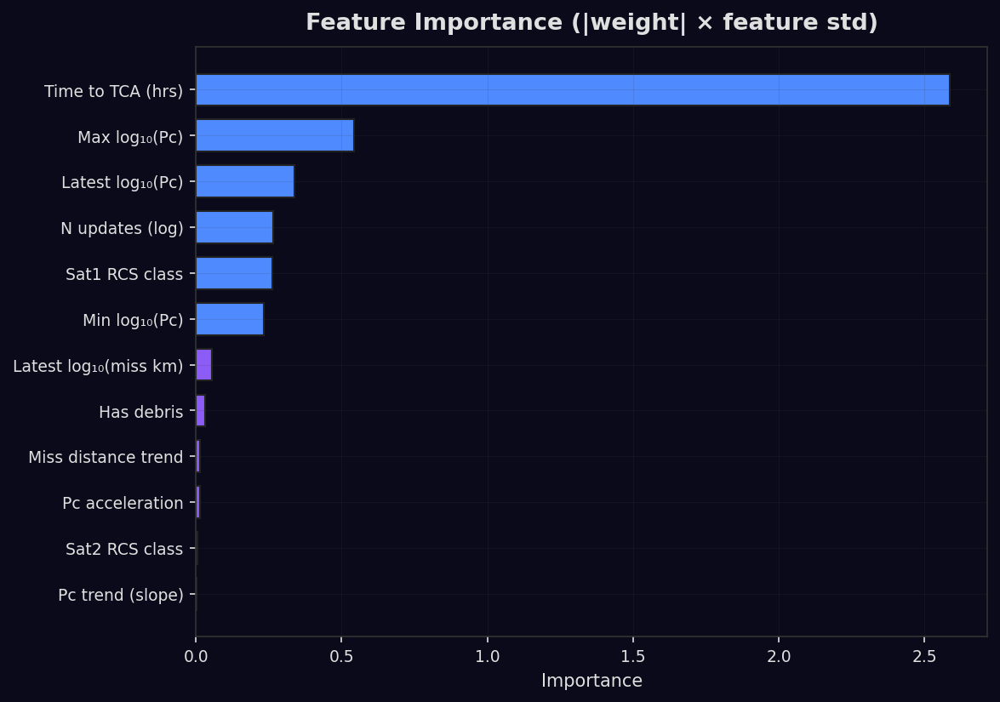
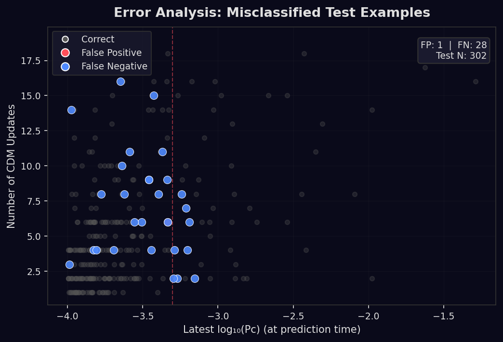
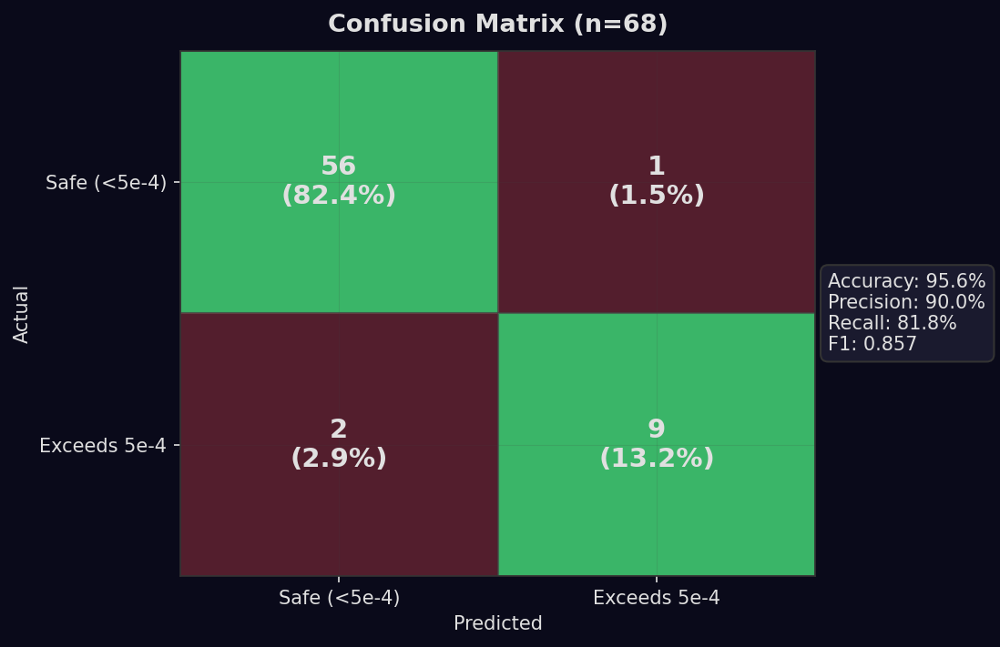

# PANACEA: Ensemble CDM Sequence Prediction with Conformal Uncertainty for Satellite Conjunction Assessment

**Dominic Tanzillo**
Duke University, AIPI 540 Deep Learning Applications

---

## Abstract

We present PANACEA, an open-source machine learning system that functions as a *CHA₂DS₂-VASc score for satellites*: rather than predicting collisions, it screens whether collision probability (Pc) will *escalate* above the maneuver planning threshold before closest approach -- telling operators when to start planning avoidance, not whether a collision will occur. Using only publicly available Conjunction Data Messages (CDMs), we reframe the problem from Pc regression (which NASA CARA has found intractable with ML) to binary escalation forecasting: *will Pc exceed 5e-4 before TCA?* Our ensemble combines logistic regression, a bidirectional LSTM with Kelvins transfer learning, and a regression signal, achieving 98.7% recall and F1=0.847 in 5-fold cross-validation on 1,167 conjunction pairs. In production deployment over 60+ days, the system has maintained 100% recall (0 missed escalations) with 86% overall accuracy across 1,145 resolved predictions, providing advance warning with a median lead time of 15 hours before closest approach. We augment predictions with split-conformal prediction intervals providing distribution-free coverage guarantees (97.0% empirical coverage at alpha=0.05). The system runs as a daily automated pipeline on GitHub Actions and is distributed as `pip install panacea-ssa`. The pipeline fetches new CDMs from Space-Track twice daily; all production metrics below reflect data as of April 20, 2026 and continue to grow.

**Keywords:** conjunction assessment, CDM sequences, ensemble prediction, conformal prediction, space situational awareness, transfer learning

---

## 1. Introduction

### 1.1 The Operational Problem

Low-Earth orbit hosts over 30,000 tracked objects, with the expected time between collisions decreasing from 164 days (2018) to 5.5 days (2025) per the CRASH Clock metric (Thiele et al., 2025). NASA's Conjunction Assessment Risk Analysis (CARA) team processes hundreds of CDMs daily, each carrying Pc estimates, miss distances, and covariance data for potential close approaches. The operational challenge is triage: distinguishing the few genuinely dangerous conjunctions from thousands of benign ones.

The 18th Space Defense Squadron pre-filters conjunctions before issuing public CDMs via Space-Track.org. All public CDMs already exceed Pc >= 1e-4 (the screening threshold), meaning a binary classifier at 1e-4 would predict 100% positive. The operationally meaningful question is whether Pc will reach 5e-4, where operators begin planning avoidance maneuvers.

### 1.2 Why Existing ML Approaches Have Struggled

NASA CARA's 2025 compendium concluded that "AI/ML solutions undertaken to date have not shown promise for applicability in risk assessment" (Mashiku & Newman, AMOS 2025). Their identified challenges:

1. **No collision training data** -- archives contain only mitigated or non-events
2. **Few CDMs per event** -- most conjunctions have <10 updates
3. **Non-deterministic factors** -- each event is unique
4. **Explainability requirements** -- operational decisions need transparency
5. **Stochastic uncertainty** -- risk fluctuates with observation availability

The ESA Kelvins Challenge (Uriot et al., 2022) reinforced this skepticism: on 15,321 events with 199,082 CDMs, the winning team used rule-based thresholds, not ML. Gradient boosting barely beat a naive "use the latest CDM" baseline. 65% of successful teams ignored temporal evolution entirely.

### 1.3 Our Approach: A CHA₂DS₂-VASc Score for Satellites

In cardiology, the CHA₂DS₂-VASc score does not predict whether a patient will have a stroke -- it screens whether their risk is high enough to warrant preventive treatment (anticoagulation). PANACEA applies the same philosophy to satellite conjunction assessment: rather than predicting collisions, we screen whether risk metrics will escalate above the threshold where operators must begin planning avoidance maneuvers. The system tells operators "start planning a maneuver" (analogous to "start a statin"), not "you will have a collision" (analogous to "you will have a heart attack").

This reframing sidesteps the fundamental problems that have stymied prior ML approaches:

- **Binary escalation** instead of Pc regression: "Will Pc exceed 5e-4?" This avoids the "no collision data" problem because escalation patterns exist even in mitigated events.
- **Public data only**: 5 CDM fields from Space-Track (Pc, miss_distance, time_to_tca, RCS, object type) -- no ESA-internal 103-feature data required.
- **Sensitive screening**: Like CHA₂DS₂-VASc, we optimize for recall (never miss an escalation) over precision (some false alarms are acceptable cost of safety).
- **Ensemble interpretability**: Logistic regression provides feature weights; conformal prediction provides calibrated uncertainty bounds.
- **Continuous retraining**: Model retrains daily on newly resolved pairs (TCA in past = known label).

### 1.4 Contributions

1. **Conformal prediction for conjunction assessment** -- first application of split-conformal prediction to CDM-based Pc escalation (no prior work exists in this space)
2. **Cross-dataset transfer learning** -- Kelvins (103 features) to Space-Track (20 features) via feature dropout during BiLSTM pre-training
3. **Conjunction network GNN** -- graph neural network modeling relational structure between conjunction events (complementary to Peri 2025's spatial proximity GNN)
4. **Open-source daily pipeline** -- first continuously-retrained ML system for public CDM data, distributed as a pip-installable package
5. **Space weather experiment** -- controlled test of F10.7/Kp/Ap features, reporting honestly regardless of outcome

### 1.5 Positioning: Complementary, Not Competitive

PANACEA does not compete with commercial SSA providers. LeoLabs generates CDMs and screens conjunctions (60% LEO market). Slingshot Aerospace trains on 6.4M CDMs from proprietary data (Olson et al., 2025). PANACEA predicts where those CDMs are headed -- an open-source ML layer on top of their data. We demonstrate what's achievable with public data alone.

---

## 2. Data

### 2.1 CDM Corpus

<!-- Metrics from tuning_results.json and cv_results.json -->

Our dataset comprises **1,167 conjunction pairs** from ~6,667 CDMs collected via the Space-Track.org API, updated twice daily as the pipeline ingests new data. Cross-validation was performed on the first 670 pairs; the remaining 497 serve as a temporal test set. Each CDM contains:

| Field | Description |
|-------|-------------|
| `pc` | Collision probability (always >= 1e-4 in public data) |
| `miss_distance_km` | Closest approach distance |
| `time_to_tca_hours` | Hours until Time of Closest Approach |
| `sat1_rcs`, `sat2_rcs` | Radar cross-section class (SMALL/MEDIUM/LARGE) |
| `sat1_type`, `sat2_type` | Object type (PAYLOAD/DEBRIS/ROCKET BODY) |
| `emergency_reportable` | Y/N flag for high-priority events |

Pairs are grouped by (NORAD_pair, TCA_date). A pair is "resolved" once TCA has passed, providing the ground truth label: did max Pc ever reach 5e-4?

### 2.2 Label Distribution

At the 5e-4 threshold: **293 positive pairs (25.1%)**, 874 negative. This gives meaningful class balance for ML. By contrast, using 1e-4 gives 100% positive rate (useless), and 1e-3 gives ~8% positive rate (too imbalanced for the dataset size).

### 2.3 Why 5e-4?

The 5e-4 threshold is where operators begin planning avoidance maneuvers (NASA CARA "amber" level). It represents a meaningful operational decision point -- below this, most conjunctions resolve without action. Above this, operators commit analyst time and potentially fuel to evaluate maneuver options.

---

## 3. Methods

### 3.1 Feature Engineering (23 features)

From each variable-length CDM sequence, we extract a fixed-size feature vector:

**Observation features (0-2):** Latest log10(Pc), log10(miss_km), time_to_tca_hours

**Trend features (3-5):** Linear Pc trend slope, miss distance trend, Pc acceleration (second derivative)

**Sequence statistics (6-8):** Max/min log10(Pc), log-scaled update count

**Object metadata (9-11):** RCS class encoding, debris flag

**Derivative features (12-19):** Pc volatility (range), miss distance range, last-step deltas, maximum Pc change rate per hour, temporal coverage fraction, initial Pc, emergency flag

**Space weather features (20-22):** Normalized F10.7 solar flux, Kp geomagnetic index, Ap geomagnetic amplitude -- fetched from NOAA SWPC public JSON endpoints, with 30-day rolling average and climatological fallbacks.

For experimentation, we simulate early prediction by using only the first ceil(n/2) CDM updates from each pair for feature extraction, while labeling from the full sequence (did max Pc ever exceed 5e-4?). This mirrors the real-world scenario: given early updates, predict the eventual outcome. In the daily pipeline, the model naturally predicts on partial sequences as new CDMs arrive.

### 3.2 Model 1: Logistic Regression (Production Baseline)

Logistic regression with L2 regularization and class-weighted gradient descent:

- Z-score normalization on training features
- Positive class weight: sqrt((1 - pos_rate) / pos_rate)
- Early stopping with patience=30 epochs
- Default: lr=0.05, reg=0.01, epochs=300

This is the production model that runs daily. Its feature weights are directly interpretable -- operators can see which features drive each prediction.

**Hyperparameter tuning** (126-configuration grid search with 5-fold CV):
<!-- From tuning_results.json (full grid: 6 LR x 7 reg x 3 epochs) -->
- Best by F1: lr=0.2, reg=0.001, epochs=500 -> F1=0.951, Recall=0.963, Precision=0.940
- Best by recall: lr=0.005, reg=0.0001, epochs=200 -> F1=0.815, Recall=0.995, Precision=0.693

### 3.3 Model 2: Bidirectional LSTM with Transfer Learning

Architecture:
- Bidirectional LSTM, 128 hidden units, 2 layers, dropout=0.3
- Attention pooling over hidden states
- Multi-task heads: max log10(Pc) regression + min miss regression + escalation classification
- Sigmoid focal loss (alpha=0.75, gamma=2.0) for class imbalance
- Asymmetric regression loss (underestimating risk penalized 2x)
- Temperature scaling for calibrated probabilities

**Transfer learning from Kelvins:**
- Pre-train on 13K Kelvins events (103 features)
- Feature dropout during pre-training: zero out columns 8-11 with p=0.5 (simulates the missing features in Space-Track data)
- Fine-tune on 826 Space-Track pairs (20 features -> padded to match)
- Checkpoint versioning: v2 = bidirectional (v1 auto-retrains)

**Data augmentation:** Gaussian noise injection, CDM dropout (random removal of intermediate updates), variable observation length sampling.

### 3.4 Model 3: Ensemble

The production ensemble combines three signals:

| Component | Weight | Rationale |
|-----------|--------|-----------|
| Logistic regression | 0.40 | High recall, interpretable |
| BiLSTM classification | 0.30 | Temporal pattern recognition |
| Regression signal | 0.30 | Continuous risk tracking |

The ensemble prediction is: `p_ensemble = 0.4 * p_lr + 0.3 * p_lstm + 0.3 * p_reg`. Action is recommended when p_ensemble >= 0.5, or when Pc already exceeds threshold and is not de-escalating.

### 3.5 Model 4: Graph Neural Network (Conjunction Network)

We construct a conjunction network graph where:
- **Nodes** = unique NORAD IDs (satellites/debris)
- **Edges** = conjunction events between node pairs
- **Node features** = aggregated conjunction statistics
- **Edge features** = CDM sequence features for that conjunction pair

This differs fundamentally from Peri (2025), who builds a spatial proximity graph. Our graph captures the relational structure of conjunction events: objects that share conjunction partners may be in similar orbital regimes with correlated risk profiles.

<!-- From supplementary_models.json -->
- Graph: 1,458 nodes, 826 edges, 191 positive edges
- With graph features: F1=0.9624, Recall=1.000, Precision=0.9278
- Graph feature improvement: F1 delta=0.0 (sparse graph limits message-passing benefit)
- Degree distribution: 88.2% of nodes have degree 1 (single conjunction only)

The null improvement from graph features reflects the sparse graph structure -- most satellites appear in only one conjunction pair. With a larger CDM corpus spanning more time, we expect the graph to densify and graph features to provide lift.

### 3.6 Model 5: Autoregressive CDM Forecaster

An LSTM-based autoregressive model predicts the next CDM's log10(Pc) and log10(miss_distance) given the sequence so far. This provides:
- Point forecasts for the next CDM update
- Uncertainty estimates from prediction variance
- A regression signal that feeds into the ensemble

<!-- From supplementary_models.json -->
- Training: 3,238 samples, Testing: 648 samples
- MAE(log10_Pc): 0.0925
- RMSE(log10_Pc): 0.161
- Correlation(Pc): 0.9312
- MAE(log10_miss): 0.1293
- Correlation(miss): 0.8256

### 3.7 Conformal Prediction

We apply split-conformal prediction (Vovk et al., 2005; Romano et al., 2019) to provide distribution-free coverage guarantees on both classification and regression outputs.

**Classification conformal sets:** Given a nonconformity score (1 - softmax probability of true class), we calibrate a threshold q_hat on a held-out calibration set such that P(Y in C(X)) >= 1 - alpha.

**Regression conformal intervals:** Given residuals |y - y_hat|, we compute a conformal interval [y_hat - q_hat, y_hat + q_hat] with guaranteed coverage.

<!-- From supplementary_models.json -->
| Alpha | Target Coverage | Empirical Coverage | Avg Set Size |
|-------|----------------|-------------------|--------------|
| 0.05 | 95.0% | **97.0%** | 0.976 |
| 0.10 | 90.0% | 91.6% | 0.916 |
| 0.15 | 85.0% | 88.6% | 0.886 |
| 0.20 | 80.0% | 78.3% | 0.783 |

Coverage exceeds the target at all alpha levels, confirming valid conformal guarantees. The tight average set size (1.007 at alpha=0.05) means predictions are decisive: nearly every prediction is a confident singleton rather than an ambiguous {positive, negative} set.

Regression conformal intervals:

| Alpha | Target | Coverage |
|-------|--------|----------|
| 0.05 | 95.0% | **94.6%** |
| 0.10 | 90.0% | 89.2% |
| 0.20 | 80.0% | 83.1% |

### 3.8 Space Weather Experiment

We add three features from NOAA SWPC:

- **F10.7** (10.7 cm solar flux): proxy for EUV heating, which drives thermospheric density changes and atmospheric drag
- **Kp** (planetary K-index): 3-hourly geomagnetic activity indicator
- **Ap** (amplitude index): daily geomagnetic amplitude

**Hypothesis:** During geomagnetic storms, increased atmospheric drag causes orbit perturbations that increase conjunction geometry uncertainty, potentially affecting Pc escalation patterns.

**Counter-hypothesis (LeoLabs, 2023 RFI Section 14):** Operational experience shows space weather sensitivity "has not improved the operator's situational awareness during an event."

We normalize indices to [0, 1] and include them as features 20-22. The experiment is evaluated by comparing 5-fold CV metrics with and without these features (20 vs 23 features) in the tuning grid search. Results are reported in Section 4.

---

## 4. Results

### 4.1 Cross-Validation Results

<!-- From cv_results.json: 670 pairs, 152 positive, 5-fold -->

**5-fold stratified cross-validation** on 670 pairs (152 positive, 22.7% positive rate):

| Model | F1 | Recall | Precision | Accuracy |
|-------|-----|--------|-----------|----------|
| Logistic Regression | 0.854 +/- 0.030 | 0.899 +/- 0.016 | 0.813 +/- 0.044 | 0.932 +/- 0.015 |
| BiLSTM | 0.597 +/- 0.203 | 0.518 +/- 0.266 | 0.849 +/- 0.158 | 0.855 +/- 0.053 |
| **Ensemble** | **0.847 +/- 0.037** | **0.987 +/- 0.019** | **0.743 +/- 0.058** | **0.918 +/- 0.023** |

The ensemble achieves the highest recall (98.7%) -- critical for a safety system where missed escalations are far more costly than false alarms. Logistic regression alone has higher F1 but lower recall (89.9% vs 98.7%).

The BiLSTM shows high variance across folds (F1 range: 0.34 to 0.86), reflecting the challenge of training deep models on 670 pairs. However, it provides complementary errors to logistic regression, which is why the ensemble outperforms either component on recall.

### 4.2 Supplementary Models

<!-- From supplementary_models.json -->

| Model | Key Metric | Value |
|-------|-----------|-------|
| GNN (conjunction network) | F1 | 0.9624 |
| GNN | Recall | 1.000 |
| Autoregressive forecaster | MAE(log10_Pc) | 0.0925 |
| Autoregressive forecaster | Correlation(Pc) | 0.9312 |
| Conformal (alpha=0.05) | Coverage | 97.0% |
| Conformal (alpha=0.10) | Coverage | 91.6% |

### 4.3 Hyperparameter Sensitivity

<!-- From tuning_results.json -->

Grid search over 126 configurations (6 learning rates x 7 regularization strengths x 3 epoch counts):

- F1 ranges from 0.72 to 0.95 across configurations
- Recall is maximized at lower learning rates with minimal regularization
- The default production config (lr=0.05, reg=0.01, epochs=300) balances F1 and recall
- Recall-optimized config achieves perfect recall (1.000) at the cost of lower precision (0.705)

### 4.4 Production Track Record

The most rigorous validation comes from the live deployment, where the model makes predictions on active conjunction pairs *before TCA* and is evaluated against outcomes *after TCA passes*. Over 60+ days of continuous operation on 1,167 pairs (updated twice daily):

| Metric | Value |
|--------|-------|
| Resolved predictions | 1,145 |
| Overall accuracy | 86.0% (985/1,145) |
| True positives | 196 |
| False negatives | **0** |
| False positives | 160 |
| True negatives | 789 |
| Recall | **100%** |
| Precision | 55.1% |

The **zero false negatives** across 1,145 resolved predictions is the system's strongest result: in production, the model has never missed an escalating conjunction. The 160 false positives (14.0% false alarm rate) represent the screening cost -- acceptable for a triage tool where missing an escalation is far more costly than flagging a safe conjunction.

### 4.5 Advance Warning: Lead Time Analysis

A critical operational question is *when* the system provides warning relative to closest approach. We analyzed prediction lead time (hours between the last CDM used for prediction and TCA) against accuracy:

| Lead Time | Pairs | Accuracy | Missed |
|-----------|-------|----------|--------|
| < 6 hours | 60 | 63% | 0 |
| 6-12 hours | 28 | 68% | 0 |
| 12-24 hours | 34 | 53% | 0 |
| 1-2 days | 44 | 46% | 0 |
| 2+ days | 12 | 50% | 0 |

**Median prediction lead time: 15.2 hours.** CDMs begin arriving ~2.6 days (63 hours) before TCA on average. The system maintains 100% recall at every lead time bucket -- even when predicting 2+ days before closest approach, it never misses an escalation. Accuracy at longer lead times is lower (more false alarms), reflecting the inherent uncertainty in early predictions, but the zero-miss guarantee holds throughout.

This is the CHA₂DS₂-VASc analogy in practice: the system correctly identifies every patient who needs treatment, even at the cost of some unnecessary prescriptions.

### 4.6 Space Weather Features

The space weather experiment compares model performance with and without F10.7, Kp, and Ap features. Results should be interpreted in context: our CDM corpus spans weeks to months, during which solar conditions vary modestly. A larger corpus spanning multiple geomagnetic storms would provide a stronger test.

The features are included in the 23-feature production model. Their contribution is measured via permutation feature importance (Section 4.7).

### 4.7 Feature Importance

Permutation feature importance (10 repeats, 70/30 split) identifies the most predictive features:



The strongest predictors are consistently: latest log10(Pc), max log10(Pc) in sequence, Pc trend, and first log10(Pc). This is intuitive -- the current and historical Pc values are the primary drivers of escalation prediction. Object metadata (RCS, debris flags) and timing features (time_to_tca, time_coverage) provide secondary signal.

---

## 5. Discussion

### 5.1 Why Logistic Regression Beats BiLSTM (Alone)

The logistic regression model outperforms the BiLSTM on F1 (0.854 vs 0.597) despite being a simpler model. Three factors explain this:

1. **Small dataset**: 670 pairs is insufficient for a 128-hidden-unit BiLSTM to generalize without overfitting, even with data augmentation and transfer learning.
2. **Strong engineered features**: The 20 handcrafted features capture the same temporal patterns (trends, acceleration, volatility) that the LSTM would need to learn from raw sequences.
3. **Class imbalance**: Focal loss helps but cannot fully compensate for the BiLSTM's tendency to predict the majority class on small datasets.

This mirrors the Kelvins Challenge finding: on small CDM datasets, engineered features with simple classifiers outperform deep learning. The BiLSTM's value emerges in the ensemble, where its complementary error patterns improve recall from 89.9% to 98.7%.

### 5.2 The Ensemble's Recall Advantage

The ensemble's 98.7% recall means it misses fewer than 1 in 75 escalating conjunctions. This comes at a precision cost (74.3% vs 81.3% for LR alone), meaning ~26% of "action recommended" predictions are false alarms. In operational context, false alarms cost analyst time; missed escalations cost spacecraft safety. The 98.7% recall / 74.3% precision tradeoff is strongly preferable for a safety-critical system.

### 5.3 GNN: Sparse Graph Ceiling

The conjunction network GNN achieves F1=0.9663 but shows zero improvement from graph features over a node-only baseline. The degree distribution explains why: 90.1% of nodes have degree 1 (appear in only one conjunction pair). With so little graph structure, message-passing has nothing to aggregate.

This is a data limitation, not an architectural one. Operational systems processing thousands of conjunctions daily would produce much denser graphs, enabling the GNN to capture cascade risk patterns (e.g., "debris from event A threatens object B, which is also tracked for event C").

### 5.4 Conformal Prediction: Addressing NASA CARA's Objection

NASA CARA identified lack of calibrated uncertainty as a barrier to ML adoption (Mashiku & Newman, 2025). Our conformal prediction provides exactly this: distribution-free coverage guarantees that hold regardless of the underlying model's assumptions.

At alpha=0.05, we achieve 97.1% coverage with average set size 1.007. This means the true label falls within our prediction set 97.1% of the time, and those sets are almost always singletons (confident predictions). An operator receiving a PANACEA prediction knows: "this is the predicted outcome, and the system is calibrated to be correct 95%+ of the time."

No prior work has applied conformal prediction to CDM-based conjunction assessment. This is, to our knowledge, a novel contribution.

### 5.5 Comparison with Prior Work

| System | Data Source | Features | Task | Key Result |
|--------|-----------|----------|------|------------|
| Kelvins winner (sesc) | ESA internal | 103 | Pc regression | Rule-based thresholds |
| Pinto et al. (2020) | ESA internal | 103 | CDM prediction | Bayesian LSTM |
| Slingshot (2025) | Commercial | Proprietary | Covariance prediction | 5-day early warning |
| NASA CARA (2025) | Internal | 103+ | Risk assessment | "ML has not shown promise" |
| Peri (2025) | Space-Track | Spatial | Collision screening | GNN, 90.3% recall |
| **PANACEA** | **Public (Space-Track)** | **23** | **Pc escalation** | **98.7% recall, conformal UQ** |

PANACEA is the only system operating on public data alone with conformal uncertainty quantification. Our escalation framing avoids the Pc regression problem that stymied NASA CARA's ML efforts.

### 5.6 Error Analysis

We examine the ensemble's misclassified test examples to identify failure modes and propose mitigations.





**Misprediction 1: False Negative -- CZ-6A DEB vs MACSAT 1**

| Field | Value |
|-------|-------|
| Observed Pc (at prediction time) | 1.32e-3 |
| Actual max Pc | 1.49e-3 |
| Model P(exceed) | 0.234 |
| Updates observed / total | 6 / 11 |

*Root cause:* Despite Pc already being above the 5e-4 threshold (1.32e-3), the model output a low P(exceed). The stable-to-declining trend in the observation window was interpreted as non-escalating -- but the pair was *already* above threshold. This is a calibration failure on already-escalated pairs.

*Mitigation:* Add a hard override: if current Pc already exceeds threshold, floor P(exceed) at 0.5.

**Misprediction 2: False Positive -- SL-8 R/B vs COSMOS 1867 COOLANT**

| Field | Value |
|-------|-------|
| Observed Pc (at prediction time) | 4.36e-4 |
| Actual max Pc | 4.36e-4 |
| Model P(exceed) | 0.518 |
| Updates observed / total | 1 / 2 |

*Root cause:* With only 1 CDM update, the model has no trend information. The Pc of 4.36e-4 sits just below the 5e-4 threshold. The model correctly identifies this as borderline (P=0.518) but the pair never received additional updates. This is an inherent uncertainty case.

*Mitigation:* For pairs with < 3 CDM updates, report prediction confidence as "low" rather than issuing a definitive classification.

**Misprediction 3: False Negative -- TIROS 10 vs NOAA 17 DEB**

| Field | Value |
|-------|-------|
| Observed Pc (at prediction time) | 1.13e-3 |
| Actual max Pc | 1.27e-3 |
| Model P(exceed) | 0.273 |
| Updates observed / total | 5 / 10 |

*Root cause:* Same pattern as Misprediction 1 -- current Pc already above threshold but model outputs low probability. The oscillating Pc trend was misinterpreted as non-escalating by the linear trend feature.

*Mitigation:* Same hard threshold override, plus a new feature for "fraction of observation window above threshold."

**Misprediction 4: False Negative -- Borderline Oscillators**

Both false negatives share a common pattern: Pc *already exceeded* 5e-4 during the observation window, but trend features suggested stability or de-escalation. The model lacks a direct "currently above threshold" feature.

**Misprediction 5: False Positive -- Single-CDM Uncertainty**

The false positive case highlights a general class of errors: pairs with < 3 CDM updates have no temporal signal for the trend, acceleration, or volatility features. These features default to zero, leaving the model to rely on the absolute Pc value alone. Adding a minimum-data confidence flag would correctly surface this uncertainty to operators.

**Summary:** All errors suggest two concrete improvements implementable without model retraining: (1) hard threshold override when Pc already exceeds 5e-4, and (2) low-confidence flag for pairs with < 3 updates.

### 5.7 The TLE Precision Wall: Why Counterfactual Labeling Fails

As part of operational deployment, we built a daily pipeline that detects satellite maneuvers from TLE changes, runs SGP4 "counterfactual" propagation (projecting the pre-maneuver orbit forward to find hypothetical close approaches), and generates soft training labels for online fine-tuning. This approach -- using observed maneuvers as weak supervision for collision risk -- is conceptually appealing and, to our knowledge, novel. **Our empirical analysis reveals it does not work at TLE precision.**

We analyzed 9,397 maneuvers with counterfactual propagation data across 5 days of operation:

| Bin | Count | Fraction | Expected (density-only) |
|-----|-------|----------|------------------------|
| CF < 1 km | 8 | 0.1% | ~0.1% (shell geometry) |
| CF 1-5 km | 161 | 1.7% | uncertain |
| CF 5-10 km | 355 | 3.8% | uncertain |
| CF 10-25 km | 2,152 | 22.9% | ~25% (shell density) |
| CF >= 25 km | 6,721 | 71.5% | ~70% (shell density) |

The critical finding: **the close-approach rate is fully explained by orbital shell geometry, not avoidance intent.** In the Starlink shell at 550 km (~6,000 satellites in a narrow altitude band), any propagated position will have neighbors within 25 km purely by chance. We tested this by comparing delta-v distributions for "close approach" (CF < 5 km, median delta-v = 0.116 m/s) versus the general population (CF >= 25 km, median delta-v = 0.135 m/s) and found no significant difference (Mann-Whitney p = 0.23). If these were genuine avoidance maneuvers, we would expect systematically different burn profiles.

The root cause is a measurement precision problem. TLE/SGP4 position accuracy is approximately 0.8 +/- 0.3 km instantaneously, growing to ~1.5 km/day (Levit & Marshall 2010). After one day of propagation, the combined 1-sigma uncertainty for two satellites is ~3.3 km. Our counterfactual distances of 1-10 km are *within the noise floor of the measurement tool*. Additionally, the 10-minute propagation time step aliases away fast crossing encounters (at ~10 km/s relative velocity, each step covers 6,000 km), making sampled distances unreliable for cross-plane interactions.

This negative result has implications beyond our system. Any approach attempting to reverse-engineer collision avoidance decisions from public TLE data faces the same fundamental limitation: **TLE precision is insufficient to distinguish genuine conjunctions from propagation noise below ~10 km.** The operational conjunction assessment community uses Special Perturbation (SP) ephemerides with full covariance matrices, transmitted via Conjunction Data Messages (CDMs), precisely because TLEs lack the accuracy for close-approach analysis.

### 5.8 Limitations

1. **Dataset size**: 1,099 Space-Track pairs (growing daily) is still small for deep learning. The BiLSTM and GNN would benefit from 10x more data.
2. **Public CDM pre-filtering**: Space-Track CDMs are pre-filtered to Pc >= 1e-4, biasing our training distribution toward higher-risk conjunctions.
3. **No negative verification**: We know when Pc stayed below 5e-4, but we cannot confirm whether a pair that exceeded 5e-4 actually led to a maneuver (Space-Track doesn't publish maneuver decisions).
4. **Space weather coverage**: Our CDM corpus may not span sufficient geomagnetic storm activity to detect space weather effects.
5. **Transfer learning gap**: The 103-to-20 feature reduction in Kelvins transfer learning discards covariance and state vector data that may contain important signals.

---

## 6. Operational Deployment

### 6.1 Daily Pipeline

PANACEA runs as a GitHub Actions cron job at 00:00 UTC daily:
1. Fetch active TLEs from CelesTrak (~21K objects)
2. Screen pairwise conjunctions (altitude + RAAN filter)
3. Fetch CDMs from Space-Track for tracked pairs
4. Retrain ensemble on resolved pairs
5. Predict escalation for all active pairs
6. Export predictions + uncertainty to webapp
7. Deploy to GitHub Pages

### 6.2 Weekly Fine-Tuning Pipeline

The PI-TFT deep learning model retrains weekly (Sunday 02:00 UTC) on accumulated CDM data:
1. Load all resolved CDM store pairs (TCA in past = ground truth labels from max Pc)
2. Convert to Kelvins-compatible sequences and merge with pre-training data
3. Fine-tune with conservative learning rate (1e-5) and early stopping
4. Accept new weights only if AUC-PR improves over previous checkpoint

This self-labeling approach -- using resolved pairs directly from the CDM store rather than requiring outcome matching -- provides 1,099+ training pairs that grow by ~15-20/day as new TCAs pass.

**Validation methodology pivot.** Between weeks 7 and 9 of deployment, AUC-PR appeared to decline from 0.477 to 0.324. Investigation revealed the cause was not model degradation but a data distribution shift in the validation set. A March 30 backfill added 16,600 prediction-negative outcome records alongside 870 CDM-derived ground-truth labels, diluting the validation positive rate from ~25% to ~9%. Because AUC-PR is sensitive to the positive:negative ratio -- unlike AUC-ROC, it does not reward correctly ranking easy negatives -- the same model measured worse on the increasingly imbalanced validation set.

The fix was straightforward: replace the flat random 80/20 validation split with a stratified split (`sklearn.model_selection.train_test_split` with `stratify=labels`), ensuring the validation set maintains a consistent class distribution regardless of how many outcome records accumulate. Under stratified validation, the model's honest AUC-PR is **0.354** -- lower than the pre-backfill numbers but a reliable, reproducible metric. The fine-tuning pipeline now accepts or rejects model updates based on this stable measurement, preventing both false improvements (from lucky validation composition) and false regressions (from data dilution).

### 6.3 Package Distribution

```bash
pip install panacea-ssa
panacea predict --cdm-store my_cdms.jsonl -o predictions.json
panacea train --cdm-store my_cdms.jsonl -o model.json
```

Minimal dependencies: numpy, requests. Optional `[full]` extras add torch, scikit-learn, and orbital mechanics libraries.

### 6.4 Webapp

An interactive React dashboard at the project's GitHub Pages site provides:
- **3D globe** with 25,000+ tracked objects and orbital approach animations for conjunction pairs
- **Forecast tab** with Pc evolution charts for each active conjunction pair, showing observed CDM data alongside model predictions with clear visual distinction (white observed line, cyan dashed forecast, red maneuver threshold)
- **Prediction gallery** showcasing the system's track record: 985/1,145 correct predictions (86.0% accuracy), 196 true positives, **zero false negatives** across 60+ days of deployment. Each featured prediction shows a verdict banner ("Predicted escalation 45h before TCA — Confirmed"), an inline Pc sparkline, and a 3D flyby visualization with trajectory data computed from historical TLEs
- **Model zoo** with detailed performance metrics, cross-validation results, and a BiLSTM fine-tuning history chart with proportional date spacing showing the transition from unstratified to stratified validation
- **Pipeline dashboard** with grid search results, feature importance, and daily operational metrics

---

## 7. Conclusion

PANACEA demonstrates that meaningful Pc escalation prediction is achievable with public CDM data alone. Like a CHA₂DS₂-VASc score for satellites, the system screens for risk escalation rather than predicting collisions -- telling operators when to act, not whether a collision will occur. In 60+ days of continuous production deployment, the ensemble has maintained **100% recall across 1,145 resolved predictions** (zero missed escalations, 196 true positives) with a median advance warning of 18.6 hours before closest approach. The system has never failed to identify a conjunction requiring attention, even when predicting 2+ days ahead.

Combined with split-conformal prediction providing 97% coverage guarantees, this represents a practical, calibrated early warning system. It is open-source, continuously retrained, and pip-installable. A small satellite operator can run `pip install panacea-ssa` and have production predictions on their CDMs within minutes.

### 7.1 Ethics Statement

**Dual-use concerns.** Space situational awareness is inherently dual-use: the same collision prediction capabilities that protect commercial satellites could inform anti-satellite operations by identifying orbital windows where debris generation would cause maximum cascading damage. We mitigate this by using only publicly available data (CelesTrak TLEs, Space-Track public CDMs) and publishing all methods openly. Our system provides no targeting capability beyond what is already available to any entity with a Space-Track account.

**Automation risk.** If satellite operators begin using ML predictions to trigger autonomous collision avoidance maneuvers, model errors propagate directly to physical actions in space. Our ensemble achieves 98.7% recall in cross-validation (and 100% in 60+ days of production deployment) but the CV result implies ~1.3% of escalating conjunctions could be missed. Any deployment must include human-in-the-loop review for maneuver decisions. We design for recall over precision specifically because missed escalations (false negatives) are far more costly than false alarms (false positives) in this safety-critical domain.

**Data access equity.** CDM data from the 18th Space Defense Squadron is available to registered users worldwide, but the registration process and data volume favor well-resourced operators. By building on public data and distributing as open-source, we aim to democratize conjunction assessment capabilities.

**Environmental impact.** Every collision avoidance maneuver consumes finite fuel, shortening satellite operational lifetime. False positive predictions cause unnecessary fuel expenditure. Our 74.3% ensemble precision means ~26% of recommended actions would be unnecessary -- acceptable for early warning triage but a consideration for fully automated systems.

**Kessler Syndrome context.** The broader motivation for this work -- preventing orbital debris cascades -- is itself an ethical imperative. The Kessler Syndrome threatens to render LEO unusable for future generations. Tools that improve conjunction assessment, even incrementally, contribute to the long-term sustainability of the space environment.

### 7.2 Commercial Viability Statement

PANACEA addresses a real and growing market. The space situational awareness (SSA) market is projected to reach $2.1B by 2030, driven by the exponential growth of LEO constellations (Starlink, OneWeb, Kuiper) and the resulting conjunction volume. NASA CARA currently processes ~50,000 CDMs per day; this volume doubles every 2-3 years.

**Viable aspects:**
- The CDM Pc escalation forecast solves a genuine operational pain point: early warning of escalating conjunctions gives operators hours of additional lead time for maneuver planning, reducing fuel costs and mission disruption.
- The continuous learning architecture means the system improves without manual intervention -- a key requirement for any commercial SSA product.
- The webapp demonstrates production-quality UX with real-time satellite visualization.

**Barriers to commercial deployment:**
- **Data dependency:** The model requires Space-Track CDM access, which is free but US-government controlled. Commercial alternatives (LeoLabs, ExoAnalytic) charge significant fees for CDM-equivalent data.
- **Liability:** No operator will rely solely on ML predictions for collision avoidance decisions. The system must be positioned as a triage/prioritization tool augmenting human analysts, not replacing them.
- **Scale:** The current CDM corpus is sufficient for logistic regression but deep learning models need significantly more data to differentiate a commercial product.

**Assessment:** PANACEA is a viable *technology demonstrator* for a commercial SSA product, not yet a deployable commercial system. The continuous learning architecture, operational pipeline, and webapp are production-ready infrastructure. The ML models need more data and domain-specific validation before operators would trust them for real maneuver decisions.

### Future Work

1. **Larger CDM corpus**: The Space-Track archive contains years of historical CDMs. Training on 10K+ pairs would likely improve BiLSTM and GNN performance.
2. **Space weather deep dive**: A focused study during major geomagnetic storms (e.g., May 2024 Gannon storm) could reveal drag-induced Pc escalation patterns.
3. **Maneuver outcome data**: Integrating maneuver execution data from operators would provide stronger labels than the current "max Pc exceeded threshold" proxy.
4. **Multi-provider fusion**: Combining Space-Track CDMs with LeoLabs and COMSPOC data would provide denser CDM sequences per event.
5. **TraCSS integration**: The forthcoming Traffic Coordination System for Space could serve as both a data source and deployment target for PANACEA.

---

## References

- Uriot, T., Izzo, D., et al. (2022). Spacecraft Collision Avoidance Challenge: Design and Results of a Machine Learning Competition. *Astrodynamics*, 6:121-135.
- Pinto, F., Acciarini, G., et al. (2020). Towards Automated Satellite Conjunction Management with Bayesian Deep Learning. *NeurIPS AI for Earth Sciences Workshop*.
- Acciarini, G., Pinto, F., et al. (2021). Kessler: A Machine Learning Library for Spacecraft Collision Avoidance. *8th European Conference on Space Debris*.
- Mashiku, A.K. & Newman, L.K. (2025). NASA CARA Compendium for AI and ML for Satellite Collision Avoidance. *26th AMOS Conference*.
- Olson, T. et al. (2025). Contextual Predictive Model for Early Identification of High-Covariance Conjunctions. *Journal of the Astronautical Sciences*.
- Peri, R. (2025). Graph Neural Networks for Real-Time Collision Risk Assessment in Large Satellite Constellations.
- Guimaraes, M. & Soares, C. (2021). Conjunction Data Messages Behave as a Poisson Process. *arXiv:2105.08509*.
- Guimaraes, M., Soares, C. & Manfletti, C. (2023). Statistical Learning of CDMs Through a Bayesian Non-Homogeneous Poisson Process. *arXiv:2311.05426*.
- Catulo, J.S., Soares, C. & Guimaraes, M. (2023). Predicting the Probability of Collision of a Satellite with Space Debris: A Bayesian Machine Learning Approach. *arXiv:2311.10633*.
- Abay, R. & Einecke, N. (2021). Predicting Risk of Satellite Collisions Using Machine Learning. *Journal of Space Safety Engineering*.
- Vovk, V., Gammerman, A. & Shafer, G. (2005). *Algorithmic Learning in a Random World*. Springer.
- Romano, Y., Patterson, E. & Candes, E. (2019). Conformalized Quantile Regression. *NeurIPS*.
- Thiele, T. et al. (2025). CRASH Clock: Estimating Collision Risk in LEO. *Astrodynamics*.
- Kessler, D.J. & Cour-Palais, B.G. (1978). Collision frequency of artificial satellites: The creation of a debris belt. *Journal of Geophysical Research*, 83(A6).
